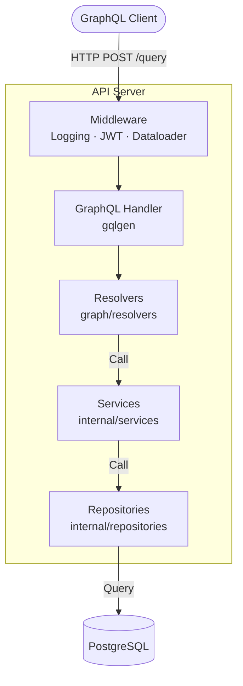

# Go GraphQL API Boilerplate

A production-ready GraphQL API built with Go, **gqlgen** (schema-first), **PostgreSQL (sqlx)**, **JWT Authentication**, and **Dataloaders** to solve N+1 problems.

[](https://github.com/ElioNeto/go-graphql-api-boilerplate/actions/workflows/ci.yml)
[](https://go.dev/)
[](./LICENSE)

---

## 📚 Documentation

- **[Getting Started Guide](./docs/GETTING_STARTED.md)** - Complete setup instructions and GraphQL basics
- **[GraphQL Examples](./docs/GRAPHQL_EXAMPLES.md)** - Comprehensive query/mutation examples, authentication, and client libraries
- **[Deployment Guide](./docs/DEPLOYMENT.md)** - Production deployment for Docker, AWS, Kubernetes, and serverless

---

## ✨ Features

- ✅ **Schema-First GraphQL** - Using gqlgen for type-safe GraphQL APIs
- ✅ **Dataloader Pattern** - Automatic N+1 query prevention with batching and caching
- ✅ **JWT Authentication** - Secure token-based authentication
- ✅ **PostgreSQL** - Robust relational database with migrations
- ✅ **Clean Architecture** - Resolver → Service → Repository layers
- ✅ **GraphQL Playground** - Built-in interactive API explorer
- ✅ **Structured Logging** - Using Go's native `slog` package
- ✅ **Docker Ready** - Multi-stage Dockerfile for production
- ✅ **CI/CD** - GitHub Actions for automated testing
- ✅ **Testing** - Unit tests with mocks

---

## Architecture



### Dataloader Benefits

**Without Dataloaders** (N+1 Problem):
```graphql
query {
  posts {          # 1 query for posts
    id
    title
    author {       # N queries (one per post)
      name
    }
  }
}
# Total: N+1 queries
```

**With Dataloaders** (Optimized):
```
1 query for posts
1 batched query for all authors
Total: 2 queries ✅
```

---

## Quick Start

### Prerequisites

- Go 1.22+
- PostgreSQL 15+
- Docker & Docker Compose (optional)

### 1. Clone & Configure

```bash
git clone https://github.com/ElioNeto/go-graphql-api-boilerplate.git
cd go-graphql-api-boilerplate
cp .env.example .env
# Edit .env with your settings
```

### 2. Run with Docker Compose (Recommended)

```bash
docker-compose up -d
```

The GraphQL Playground will be available at `http://localhost:8080/`

### 3. Or Run Locally

```bash
# Install dependencies
make tidy

# Generate GraphQL code (important!)
make generate

# Create database
createdb graphql_db

# Run migrations
make migrate-up

# Start the server
make run
```

### 4. Try Your First Query

Open [http://localhost:8080/](http://localhost:8080/) in your browser.

**Register a user:**
```graphql
mutation {
  createUser(input: {
    name: "Alice"
    email: "alice@example.com"
    password: "SecurePass123!"
  }) {
    id
    name
    email
  }
}
```

**Login:**
```graphql
mutation {
  login(input: {
    email: "alice@example.com"
    password: "SecurePass123!"
  }) {
    token
    user {
      id
      name
    }
  }
}
```

**Get current user** (add token to HTTP Headers: `Authorization: Bearer <token>`):
```graphql
query {
  me {
    id
    name
    email
  }
}
```

For more examples, see the [GraphQL Examples](./docs/GRAPHQL_EXAMPLES.md) guide.

---

## Directory Structure

```
go-graphql-api-boilerplate/
├── cmd/
│   └── api/
│       └── main.go                 # Entry point
├── graph/
│   ├── schema.graphqls         # GraphQL schema definition
│   ├── schema.resolvers.go     # Resolver implementations
│   ├── generated.go            # Generated by gqlgen
│   └── model/                  # Generated GraphQL models
├── internal/
│   ├── config/                 # Environment configuration
│   ├── dataloaders/            # N+1 prevention with batching
│   ├── middleware/             # Auth, logging, dataloader injection
│   ├── models/                 # Domain models
│   ├── repositories/           # Data access layer
│   └── services/               # Business logic
├── migrations/                 # SQL migrations
├── docs/                       # Documentation
│   ├── GETTING_STARTED.md
│   ├── GRAPHQL_EXAMPLES.md
│   └── DEPLOYMENT.md
├── .github/workflows/          # CI/CD
├── Dockerfile
├── docker-compose.yml
├── gqlgen.yml                  # gqlgen configuration
├── Makefile
└── README.md
```

---

## GraphQL Schema

The API is **schema-first**. Define your schema in `graph/schema.graphqls`, then generate code:

```bash
make generate
```

### Key Schema Elements

```graphql
type User {
  id: ID!
  name: String!
  email: String!
  createdAt: Time!
  updatedAt: Time!
}

input CreateUserInput {
  name: String!
  email: String!
  password: String!
}

type Query {
  me: User!
  user(id: ID!): User
  users: [User!]!
}

type Mutation {
  createUser(input: CreateUserInput!): User!
  login(input: LoginInput!): AuthPayload!
}
```

---

## Testing

```bash
# Run all tests
make test

# Run with coverage
make test-coverage

# Run specific package tests
go test ./internal/services/... -v
```

---

## Docker

```bash
# Run with docker-compose (includes PostgreSQL)
docker-compose up -d

# View logs
docker-compose logs -f api

# Stop services
docker-compose down
```

---

## Deployment

This boilerplate is production-ready and can be deployed to:

- **Docker / Docker Compose** - Container-based deployment
- **AWS ECS / Fargate** - Fully managed containers
- **AWS App Runner** - Easiest AWS deployment
- **AWS Lambda + API Gateway** - Serverless GraphQL
- **Kubernetes** - Scalable container orchestration
- **Railway / Render** - Simple PaaS deployment

**Important for Production:**
- Set `GRAPHQL_PLAYGROUND_ENABLED=false`
- Set `GRAPHQL_INTROSPECTION_ENABLED=false`
- Use strong JWT secrets
- Enable SSL for database connections
- Implement rate limiting

For detailed deployment instructions, check the [Deployment Guide](./docs/DEPLOYMENT.md).

---

## Environment Variables

| Variable | Default | Required | Description |
|---|---|---|---|
| `APP_ENV` | `development` | No | Environment name |
| `APP_PORT` | `8080` | No | Listen port |
| `APP_DEBUG` | `false` | No | Enable debug logging |
| `DB_HOST` | – | **Yes** | PostgreSQL host |
| `DB_PORT` | `5432` | No | PostgreSQL port |
| `DB_USER` | – | **Yes** | Database user |
| `DB_PASSWORD` | – | **Yes** | Database password |
| `DB_NAME` | – | **Yes** | Database name |
| `AUTH_JWT_SECRET` | – | **Yes** | JWT signing secret |
| `GRAPHQL_PLAYGROUND_ENABLED` | `true` | No | Enable GraphQL Playground |
| `GRAPHQL_INTROSPECTION_ENABLED` | `true` | No | Enable schema introspection |

For a complete reference, see [Getting Started Guide](./docs/GETTING_STARTED.md).

---

## Makefile Commands

```bash
# Development
make run              # Run the API
make generate         # Generate GraphQL code (after schema changes)
make tidy             # Tidy Go modules

# Database
make migrate-up       # Apply migrations
make migrate-down     # Rollback migrations
make migrate-create   # Create new migration

# Testing
make test             # Run tests
make test-coverage    # Run tests with coverage
make lint             # Run linters

# Building
make build            # Build binary
make docker-build     # Build Docker image

# Cleaning
make clean            # Remove build artifacts
```

---

## Key Concepts

### Resolvers

Resolvers connect GraphQL queries/mutations to your business logic:

```go
func (r *queryResolver) User(ctx context.Context, id string) (*models.User, error) {
    return r.UserService.GetByID(ctx, id)
}
```

### Services

Services contain business logic:

```go
func (s *UserService) GetByID(ctx context.Context, id string) (*models.User, error) {
    return s.repo.GetByID(ctx, id)
}
```

### Repositories

Repositories handle data access:

```go
func (r *UserRepository) GetByID(ctx context.Context, id string) (*models.User, error) {
    var user models.User
    err := r.db.GetContext(ctx, &user, "SELECT * FROM users WHERE id = $1", id)
    return &user, err
}
```

### Dataloaders

Dataloaders batch and cache requests automatically:

```go
// In resolver
func (r *postResolver) Author(ctx context.Context, obj *models.Post) (*models.User, error) {
    return dataloaders.GetUserLoader(ctx).Load(obj.AuthorID)
}

// Dataloader batches all author IDs and fetches in one query
```

---

## Contributing

Contributions are welcome! Please feel free to submit a Pull Request.

1. Fork the repository
2. Create your feature branch (`git checkout -b feature/amazing-feature`)
3. Make your changes
4. Run tests (`make test`)
5. Regenerate GraphQL code if schema changed (`make generate`)
6. Commit your changes (`git commit -m 'Add some amazing feature'`)
7. Push to the branch (`git push origin feature/amazing-feature`)
8. Open a Pull Request

---

## License

MIT © [Elio Neto](https://github.com/ElioNeto)

---

## Related Projects

- [Go REST API Boilerplate](https://github.com/ElioNeto/go-rest-api-boilerplate) - REST version of this boilerplate

---

## Resources

- [gqlgen Documentation](https://gqlgen.com/)
- [GraphQL Best Practices](https://graphql.org/learn/best-practices/)
- [Dataloader Pattern](https://github.com/graphql/dataloader)

---

## Support

If you find this project helpful, please consider giving it a ⭐️!
